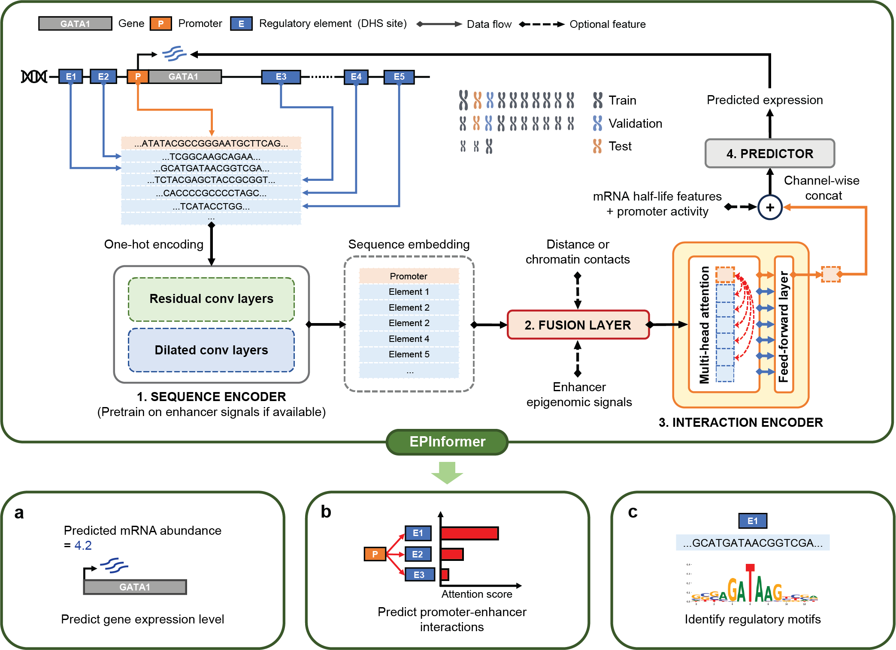
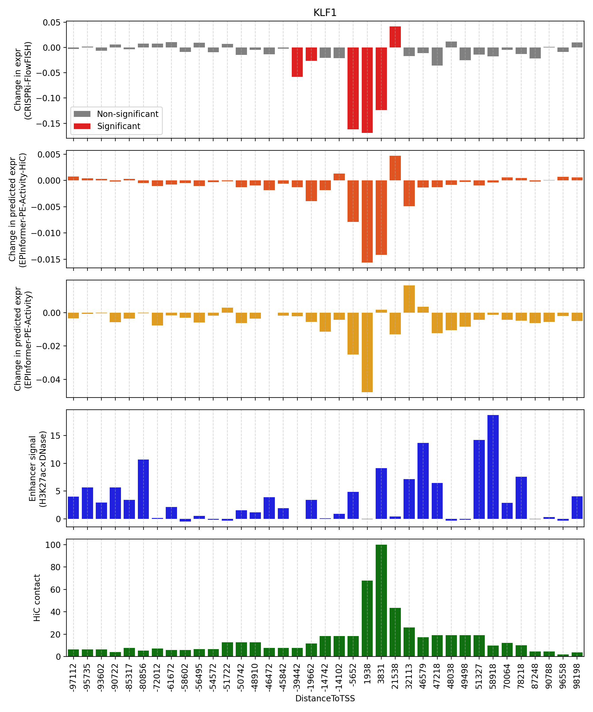

<p align="center">
  
</p>
Welcome to the EPInformer framework repository! EPInformer is a scalable deep learning framework for gene expression prediction by integrating promoter-enhancer sequences with epigenomic signals. EPInformer is designed for three key applications: 1) predict gene expression levels using promoter-enhancer sequences, epigenomic signals, and chromatin contacts; 2) identify cell-type-specific enhancer-gene interactions, validated by CRISPR perturbation experiments; 3) predict enhancer activity and recapitulate transcription factor binding motifs from sequences.

This repository can be used to run the EPInformer model to predit gene expression and prioritize enhancer-gene interactions for input DNA sequences and epigenomic signals (e.g. DNase, H3K27ac and Hi-C).

We also provide information and instructions for how to train different versions of EPInformer given diffenet inputs including DNA sequence, epigemoic signals and chromatine contacts.

<p align="center">
  
</p>

### Requirements

EPInformer requires Python 3.6+ and Python packages PyTorch (>=2.1). You can follow PyTorch installation steps [here](https://pytorch.org/get-started/locally/).

### Setup

EPInformer requires ABC enhancer-gene data for training and predicting gene expression. You can obtain the ABC data from [ENCODE](https://www.encodeproject.org/search/?type=Annotation&annotation_type=element+gene+regulatory+interaction+predictions&software_used.software.name=abc-enhancer-gene-prediction-encode_v1) or by running the ABC pipeline available on their [GitHub](https://github.com/broadinstitute/ABC-Enhancer-Gene-Prediction) acquire cell-type-specific gene-enhancer links. We provide a script [here](https://github.com/JasonLinjc/EPInformer/tree/main/data) for downloading ABC enhancer-gene links from ENCODE for *K562* and *GM12878* cells.

### 1. Gene expression prediction
To predict the gene expression measured by CAGE-seq or RNA-seq in *K562* and *GM12878* cells with EPInformer, please first run the folloing command to setup the environment:
```
# Clone this repository
git clone https://github.com/JasonLinjc/EPInformer.git
cd EPInformer

# download the pre-trained EPInformer models from zenodo (coming soon)

# create 'EPInformer_env' conda environment by running the following:
conda create --name EPInformer_env python=3.8 pandas scipy scikit-learn jupyter seaborn
source activate EPInformer_env

# GPU version putorch
conda install pytorch pytorch-cuda=12.1 -c pytorch -c nvidia
# CPU version pytorch
conda install pytorch cpuonly -c pytorch

# Other pacakges
pip install pyranges pyfaidx kipoiseq openpyxl tangermeme
```
An end-to-end example to predict gene expression from promoter-enhancer links is in [1_predict_gene_expression.ipynb](https://github.com/JasonLinjc/EPInformer/blob/main/1_predict_gene_expression.ipynb). You can run this notebook yourself to experiment with different EPInformers.

### 2. Enhancer-gene links prediction
To prioritize the enhancer-gene links tested by [CRISPRi-FlowFISH](https://www.nature.com/articles/s41588-019-0538-0) in *K562*, we obtain the original data from their [supplementary table](https://static-content.springer.com/esm/art%3A10.1038%2Fs41588-019-0538-0/MediaObjects/41588_2019_538_MOESM3_ESM.xlsx). We provide a jupyter notebook ([2_prioritize_enhancer_gene_links.ipynb](https://github.com/JasonLinjc/EPInformer/blob/main/2_prioritize_enhancer_gene_links.ipynb)) for pre-processing CRISPRi-FlowFISH data and scoring enhancer-gene links using EPInformer-derived attention scores and the Attention-ABC score. The notebook provides a end-to-end example of in-silico perturbations on candidate elements within 100kb of *KLF1* and predicting their effects, with *KLF1* excluded from the training data to prevent overfitting.
<p align="center">
  
</p>

### 3. Enhancer activity prediction and TF motif discovery
To predict cell-type-specific enhancer activity, we provide sequence-based predictors trained on H3K27ac and DNase signals in *K562* and *GM12878* cell lines separately. Enhancer activity was calculated using the [ABC score](https://github.com/broadinstitute/ABC-Enhancer-Gene-Prediction). Additionally, [Tangermeme]([https://github.com/ilyes495/tangermeme/tree/main](https://github.com/jmschrei/tangermeme)) was used to perform in-silico saturation mutagenesis (ISM) on the enhancer sequence to identify key motifs contributing to the predicted activity. The notebook ([3_predict_enhancer_activity.ipynb](https://github.com/JasonLinjc/EPInformer/blob/main/3_predict_enhancer_activity.ipynb)) is available for experimenting with enhancer activity prediction and transcription factor motif discovery.
<p align="center">
  
</p>

## Help 
Please post in the Github issues or e-mail Jiecong Lin (jieconglin@outlook.com) with any question about the repository, requests for more data, etc. 
