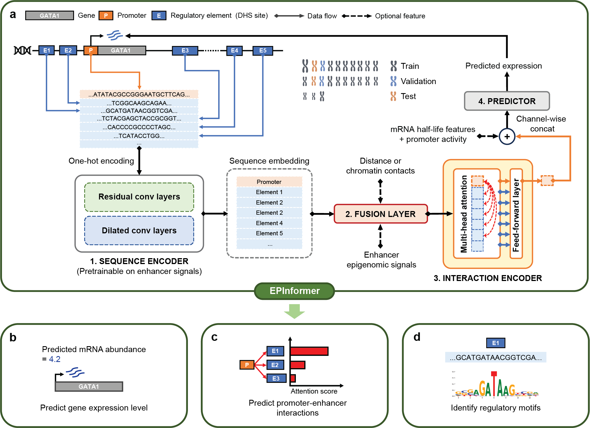
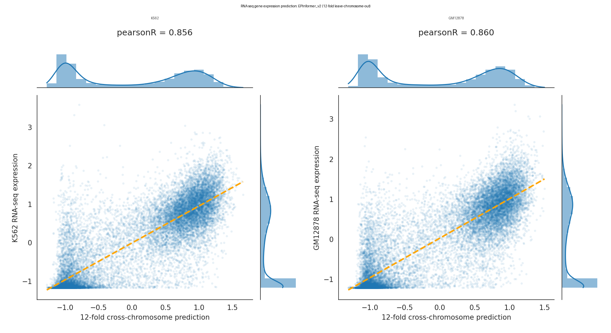

<p align="center">
  
</p>

# EPInformer

EPInformer is a scalable deep-learning framework for gene-expression prediction that integrates
promoter-enhancer sequences, epigenomic signals, and chromatin contacts. It supports three core
applications:

1. Predicting gene expression from promoter-enhancer sequence and multimodal epigenomic inputs.
2. Prioritizing cell-type-specific enhancer-gene interactions and performing in-silico perturbation.
3. Predicting enhancer activity and identifying sequence motifs that drive it.

The framework is described in Nature Communications:
[EPInformer: scalable and integrative prediction of gene expression from promoter-enhancer
sequences with multimodal epigenomic profiles](https://doi.org/10.1038/s41467-026-70535-8).

This repository provides the code and training recipes for evaluating EPInformer
variants on RNA-seq and CAGE-seq expression data.

<p align="center">
  
</p>

## Pipeline

This self-contained pipeline trains two models, in order, from raw ENCODE data across six cell
lines (K562, GM12878, H1, HepG2, HUVEC, and NHEK). It is built around
[`EPInformer/models.py`](EPInformer/models.py):

1. **Enhancer-activity encoder** — predicts 256 bp enhancer activity (H3K27ac·DNase) from sequence.
2. **Gene-expression model** (`EPInformer_v2`) — predicts RNA / CAGE from a gene's promoter plus
   its ABC-nominated enhancers, reusing the pretrained encoder (frozen) as the sequence backbone.

Run **Part 1** before **Part 2**: the expression model uses the frozen encoder trained in Part 1.

## Reproduction results

All metrics are pooled out-of-fold Pearson R from 12-fold leave-chromosome-out evaluation.

**Part 1 — enhancer encoder** (log2 activity):

| | H1 | HepG2 | K562 | HUVEC | NHEK | GM12878 |
|---|---|---|---|---|---|---|
| **ours** | 0.820 | 0.743 | 0.740 | 0.742 | 0.677 | 0.617 |

**Part 2 — gene expression**, shipped **`f3`** config (frozen encoder + 3 enhancer features + promoter signal):

| | K562 | GM12878 | HepG2 | HUVEC | NHEK | H1 |
|---|---|---|---|---|---|---|
| **RNA** | 0.856 | 0.860 | 0.845 | 0.839 | 0.828 | 0.781 |
| **CAGE** | 0.867 | 0.890 | — | — | — | — |

CAGE labels are available only for K562 and GM12878; the other four cell lines are RNA-only.
The H1, HepG2, HUVEC, and NHEK expression results are newly evaluated in this pipeline.

<p align="center">
  
</p>

> **Shipped expression configuration (`f3`):** three enhancer features (distance, activity, and
> Hi-C contact) plus promoter activity, with the pretrained encoder frozen.

---

## Datasets

All inputs are public: chromatin and Hi-C data are from **ENCODE**, expression labels are from
Xpresso/FANTOM (Zenodo), and the reference genome is **hg38**.

### ENCODE accessions (per cell)

DNase (accessibility) + H3K27ac (activity; 2 filtered bio-reps where available) + H3K27ac
**narrowPeak** (the encoder's summit source) + cell-specific **Hi-C**:

| Cell (Roadmap) | DNase | H3K27ac rep(s) | narrowPeak | Hi-C (`.hic`) |
|---|---|---|---|---|
| K562 (E123) | ENCFF257HEE | ENCFF232RQF | ENCFF544LXB | ENCFF621AIY |
| GM12878 (E116) | ENCFF729UYK, ENCFF020WZB | ENCFF269GKF, ENCFF201OHW | ENCFF023LTU | ENCFF318GOM |
| H1 (E003) | ENCFF761ZRE | ENCFF860ABR, ENCFF693IFG | ENCFF689CJG | — *(none in ENCODE — 5C/ChIA-PET only)* |
| HepG2 (E118) | ENCFF691HJY | ENCFF862NDZ, ENCFF926NHE, ENCFF745JCH | ENCFF392KDI\* | ENCFF805ALH |
| HUVEC (E122) | ENCFF091KTX | ENCFF374DGO, ENCFF609TUB | ENCFF077LGZ | ENCFF091YKP |
| NHEK (E127) | ENCFF117RNM | ENCFF770JWP, ENCFF051NTC | ENCFF666UYC | ENCFF776JNR |

- **K562** ships **single-rep** — its H3K27ac reps differ hugely in depth, so pooling dilutes.
- **GM12878** uses **both filtered reps per assay** — this is what reaches 0.617.
- **HepG2** has 3 filtered H3K27ac reps (mean-pooled); its narrowPeak (`*`) is inferred, not cited.
- Wired in [`config/samples.tsv`](config/samples.tsv), `config/encoder_narrowpeaks.json`,
  `config/extra_cells_bams.json`.

### Other inputs

- **Genome:** supply `hg38.fa` → `data/reference/hg38/hg38.fa` (not downloaded by any script).
- **ABC reference** (gene bounds, chrom sizes, K562 quantile-norm): `bash scripts/download_abc_reference.sh data/reference/hg38`.
- **Expression labels + Xpresso features + 12-fold CV split** — Zenodo **13232430**
  (`expression_data.zip`) → unzip into `data/`:
  - `GM12878_K562_18377_gene_expr_fromXpresso_with_sequence_strand.csv` — `Actual_{cell}` RNA
    for all 6 cells + `{cell}_CAGE_128*3_sum` for K562/GM12878.
  - `leave_chrom_out_crossvalidation_split_18377genes.csv` — the fold assignment.
- **ABC average Hi-C** (hg38, optional — for from-raw contact on cells without cell-specific
  `.hic`): ENCODE **`ENCFF134PUN`** (annotation `ENCSR382HAW`, 5 kb). Split into a per-chromosome
  directory with `scripts/split_avg_hic.py`, then point `hic_file` at it.

## Setup

```bash
conda env create -f environment.yml && conda activate epinformer_repro
# key deps: torch, h5py, pyfaidx, kipoiseq, pyranges, macs2, hicstraw, pyBigWig, scipy, scikit-learn, pandas
bash scripts/download_abc_reference.sh data/reference/hg38          # ABC reference
# then: place hg38.fa at data/reference/hg38/hg38.fa, and unzip Zenodo expression_data.zip into data/
```

**Pretrained checkpoints (optional):** to skip encoder training, download the pretrained enhancer
encoders (6 cell lines × 12 leave-chromosome-out folds) from Hugging Face —
[`JiecongLin/EPInformer-pipeline`](https://huggingface.co/JiecongLin/EPInformer-pipeline):

```python
from huggingface_hub import hf_hub_download
ckpt = hf_hub_download("JiecongLin/EPInformer-pipeline", "enhancer_encoders/K562/fold_8.pt")
```

See the [project wiki](https://github.com/pinellolab/EPInformer/wiki) for the full guide.

---

# Part 1 — Enhancer-activity encoder (do this first)

### 1a. Data preprocessing — download ENCODE → ABC → 256 bp activity CSV

```bash
# DNase/H3K27ac BAMs + Hi-C (K562/GM12878)
python scripts/download_encode_data.py --cell-types K562,GM12878

# GM12878 needs 2 filtered reps per assay (reaches 0.617):
python scripts/download_encode_data.py --from-manifest config/gm12878_encoder_bams.json
for f in data/GM12878/{DNase,H3K27ac}/ENCFF*.bam; do samtools index "$f"; done

# H3K27ac narrowPeaks = the encoder's summit source:
python scripts/download_encode_data.py --from-manifest config/encoder_narrowpeaks.json
gunzip -f reference/*_H3K27ac.*.narrowPeak.gz

# ABC nomination + encoder CSV
python run_pipeline.py --config config/config.yaml --samples K562,GM12878 --stages links
#   -> batch_output/{cell}/links/{cell}_peak_5bins_around_summit_activity_sequence.csv   (encoder data)
#   -> batch_output/{cell}/links/{EnhancerList,GeneList}.txt + Predictions/...            (for Part 2)
```

### 1b. Train the encoder (12-fold, 5-bin / L1KL recipe)

```bash
python train_seqEncoder.py --cell K562 \
    --data-csv batch_output/K562/links/K562_peak_5bins_around_summit_activity_sequence.csv \
    --loss l1kl --batch-size 256 --output-dir results/seqencoder/K562 --epochs 50
# HPC, all 12 folds:   CELL=K562 sbatch slurm/train_seqencoder_12fold.slurm
```

### 1c. Evaluate (target ~0.71–0.74 log2-activity Pearson)

```bash
python evaluate.py encoder --pred_dir results/seqencoder/K562
```

---

# Part 2 — Gene-expression model (do this second)

Reuses the Part 1 encoder (frozen) + the ABC enhancer–gene links from step 1a.

### 2a. Data preprocessing — ABC links → factored gene HDF5

```bash
python run_pipeline.py --config config/config.yaml --samples K562,GM12878 --stages encoding
#   -> batch_output/{cell}/encoding/{cell}_samples.h5
#      (promoter + enhancer one-hot sequence, and activity / dhs / distance / contact features)
```

### 2b. Train `EPInformer_v2` — the shipped `f3` config

```bash
python train_EPInformer.py --model_type EPInformer-v2 --cell K562 --expr_type RNA \
    --n_enh_feats 3 --use_prm_signal \
    --h5_path   batch_output/K562/encoding/K562_samples.h5 \
    --expr_csv  data/GM12878_K562_18377_gene_expr_fromXpresso_with_sequence_strand.csv \
    --split_csv data/leave_chrom_out_crossvalidation_split_18377genes.csv \
    --use_pretrained_encoder --pretrained_encoder_dir results/seqencoder/K562/checkpoints \
    --gene_list batch_output/K562/links/GeneList.txt \
    --output_dir EPInformer_models/K562 --epochs 50
# HPC, all 12 folds (f3 is the slurm default):   CELL=K562 sbatch slurm/train_epinformer_12fold.slurm
#   CAGE instead of RNA:   EXPR_TYPE=CAGE ...
#   feature ablation:      USE_PRM_SIGNAL=0 N_ENH_FEATS=1|2|3 ...   (f1=dist, f2=+activity, f3=+Hi-C)
```

`--n_enh_feats 3 --use_prm_signal` selects the shipped `f3` configuration described above. The
encoder is frozen by default; `--no_freeze_encoder` (slurm `NO_FREEZE=1`) fine-tunes it end-to-end.

### 2c. Evaluate (target RNA ~0.86 / CAGE ~0.88)

```bash
python evaluate.py expression --pred_dir EPInformer_models/K562
# visual report: open visualize_results.ipynb  (density scatter + per-fold R + cross-cell table)
```

---

## Other cell lines (H1 / HepG2 / HUVEC / NHEK) — RNA only

No CAGE labels exist for these. Their encoders train on pre-built activity CSVs, and the
gene HDF5 is built from precomputed ABC links (`scripts/build_gene_h5_for_cell.py` — no
raw BAMs needed; contact = ABC average Hi-C). Per cell (e.g. HepG2):

```bash
CELL=HepG2 sbatch slurm/train_seqencoder_12fold.slurm      # encoder -> results/seqencoder/HepG2
CELL=HepG2 sbatch slurm/build_gene_h5.slurm                # gene H5 -> batch_output/HepG2/encoding/HepG2_samples.h5
CELL=HepG2 EXPR_TYPE=RNA USE_PRM_SIGNAL=1 \
  PRETRAINED_DIR=results/seqencoder/HepG2/checkpoints \
  OUTPUT_DIR=EPInformer_models/HepG2_repro_RNA sbatch slurm/train_epinformer_12fold.slurm
python evaluate.py expression --pred_dir EPInformer_models/HepG2_repro_RNA
```

---

## Repository layout

```
EPInformer/models.py       EPInformer_v2 + 256 bp encoder  (the model)
preprocessing/             ABC nomination + HDF5 encoding
  abc/                       candidates -> neighborhoods -> contact -> predictions
run_pipeline.py            Stage 1 (links) + Stage 2 (encoding) orchestrator
train_seqEncoder.py        Part 1: enhancer-activity encoder
train_EPInformer.py        Part 2: EPInformer_v2 expression model
evaluate.py                pooled out-of-fold Pearson (encoder + expression)
scripts/                   download_encode_data, download_abc_reference,
                           build_gene_h5_for_cell, split_avg_hic (+ test_avg_hic), ...
config/                    config.yaml, samples.tsv, *_bams.json, encoder_narrowpeaks.json
slurm/                     12-fold array jobs (encoder / expression / build-H5) — gpu33 first
PIPELINE.md      detailed findings, recipe provenance, per-cell BAM/Hi-C notes
```

## Notes

- **CV:** 12-fold **leave-chromosome-out**; report the **pooled** out-of-fold Pearson (concatenate
  all 12 folds → one R), not the per-fold mean.
- **Encoder recipe**: 5 bins at summit ±192·{−2..2} (256 bp windows),
  Activity = `sqrt(H3K27ac_RPM · DNase_RPM)`, target `log2(0.1 + Activity)`, **L1KL** loss, batch 256.
- **Expression:** `EPInformer_v2` (SmoothL1 + AdamW, lr 1e-4, batch 50, 60 enhancers, frozen encoder).
- On our HPC the conda env is `EPInformer_env` (torch 2.10); override with `CONDA_ENV=` in slurm.
- Full provenance, ablations, and gotchas: **[`PIPELINE.md`](PIPELINE.md)**.
