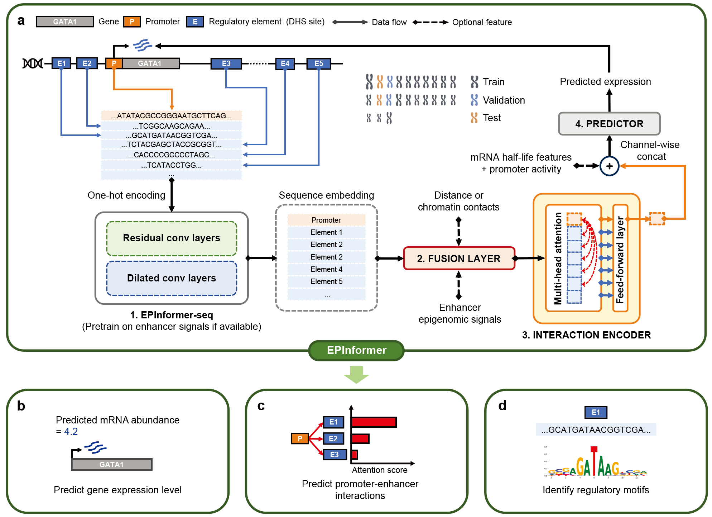
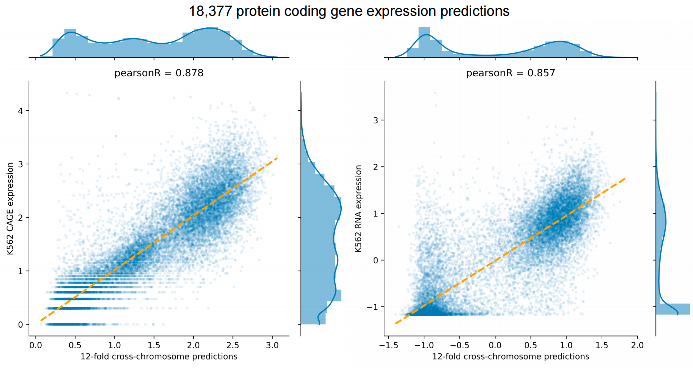

<p align="center">
  
</p>

Welcome to the EPInformer framework repository! EPInformer is a scalable deep learning framework for gene expression prediction by integrating promoter-enhancer sequences with epigenomic signals. EPInformer is designed for three key applications: 1) predict gene expression levels using promoter-enhancer sequences, epigenomic signals, and chromatin contacts; 2) identify cell-type-specific enhancer-gene interactions and conduct in-silico perturbation; 3) predict enhancer activity and recapitulate transcription factor binding motifs from sequences. The framework is described in the following bioRxiv preprint:

[https://www.biorxiv.org/content/10.1101/2024.08.01.606099v1](https://www.biorxiv.org/content/10.1101/2024.08.01.606099v1).

This repository can be used to run the EPInformer model to predit gene expression (e.g. CAGE-seq and RNA-seq) and prioritize enhancer-gene interactions for input DNA sequences and epigenomic signals (e.g. DNase, H3K27ac and Hi-C).

We also provide information and instructions for how to train different versions of EPInformer given diffenet inputs including DNA sequence, epigemoic signals and chromatine contacts.

<p align="center">
  
</p>

### Requirements

EPInformer requires Python 3.6+ and Python packages PyTorch (>=2.1). You can follow PyTorch installation steps [here](https://pytorch.org/get-started/locally/).

### Setup

EPInformer requires ABC enhancer-gene data for training and predicting gene expression. You can obtain the ABC data from [ENCODE](https://www.encodeproject.org/search/?type=Annotation&annotation_type=element+gene+regulatory+interaction+predictions&software_used.software.name=abc-enhancer-gene-prediction-encode_v1) or by running the ABC pipeline available on their [GitHub](https://github.com/broadinstitute/ABC-Enhancer-Gene-Prediction) acquire cell-type-specific gene-enhancer links. For K562 and GM12878 cell lines, you can download the training resource of EPInformer from [Zenodo](https://zenodo.org/records/13232430) by running the command: 

```
sh ./download_data.sh
```

To  experiment three applications below with EPInformer, please first run the folloing command to setup the environment:

```
# Clone this repository
git clone https://github.com/JasonLinjc/EPInformer.git
cd EPInformer

# create 'EPInformer_env' conda environment by running the following:
conda create --name EPInformer_env python=3.8 pandas scipy scikit-learn jupyter seaborn
source activate EPInformer_env

# GPU version putorch
conda install pytorch pytorch-cuda=12.1 -c pytorch -c nvidia
# CPU version pytorch
conda install pytorch cpuonly -c pytorch

# Other pacakges
pip install pyranges pyfaidx kipoiseq openpyxl tangermeme
```

### 1. Gene expression prediction

An end-to-end example to predict gene expression from promoter-enhancer sequences, epigenomic signals and chromatin contacts is in [1_predict_gene_expression.ipynb](https://github.com/JasonLinjc/EPInformer/blob/main/1_predict_gene_expression.ipynb). You can run this notebook yourself to experiment with different EPInformers.
<p align="center">
  
</p>

### 2. Enhancer-gene links prediction
To prioritize the enhancer-gene links tested by [CRISPRi-FlowFISH](https://www.nature.com/articles/s41588-019-0538-0) in K562, we obtain the original data from their [supplementary table](https://static-content.springer.com/esm/art%3A10.1038%2Fs41588-019-0538-0/MediaObjects/41588_2019_538_MOESM3_ESM.xlsx). We provide a jupyter notebook ([2_prioritize_enhancer_gene_links.ipynb](https://github.com/JasonLinjc/EPInformer/blob/main/2_prioritize_enhancer_gene_links.ipynb)) for pre-processing CRISPRi-FlowFISH data and scoring enhancer-gene links using EPInformer-derived attention scores and the Attention-ABC score. Additionally, this notebook provides a end-to-end example of in-silico perturbations on candidate elements within 100kb of *KLF1* and predicting their effects, with *KLF1* excluded from the training data to prevent overfitting.
<p align="center">
  
</p>

### 3. Enhancer activity prediction and TF motif discovery
To predict cell-type-specific enhancer activity, we provide sequence-based predictors trained on H3K27ac and DNase signals in K562 and GM12878 cell lines separately. Enhancer activity was calculated using the [ABC score](https://github.com/broadinstitute/ABC-Enhancer-Gene-Prediction). Additionally, [Tangermeme]([https://github.com/ilyes495/tangermeme/tree/main](https://github.com/jmschrei/tangermeme)) was used to perform in-silico saturation mutagenesis (ISM) on the enhancer sequence to identify key motifs contributing to the predicted activity. The notebook ([3_predict_enhancer_activity.ipynb](https://github.com/JasonLinjc/EPInformer/blob/main/3_predict_enhancer_activity.ipynb)) is available for experimenting with enhancer activity prediction and transcription factor motif discovery.
<p align="center">
  
</p>

## Training
You can re-train EPInformer models on K562 and GM12878 data using the command lines:

```
# Download K562 and GM12878 data
sh ./download_data.sh

# Train EPInformer-PE on K562 to predict CAGE-seq expression
python train_EPInformer.py --cell K562  --model_type EPInformer-PE --expr_assay CAGE --use_pretrained_encoder --batch_size 16

# Train EPInformer-PE-Activity on GM12878 to predict RNA-seq expression
python train_EPInformer.py --cell GM12878 --model_type EPInformer-PE-Activity --expr_assay RNA --use_pretrained_encoder --batch_size 16

# Train EPInformer-PE-Activity-HiC on K562 to predict RNA-seq expression
python train_EPInformer.py --cell K562 --model_type EPInformer-PE-Activity-HiC --expr_assay RNA --use_pretrained_encoder --batch_size 16
```

## Help 
Please post in the GitHub issues or e-mail Jiecong Lin (_jieconglin(at)@outlook.com_) with any question about the repository, requests for more data, etc. 
